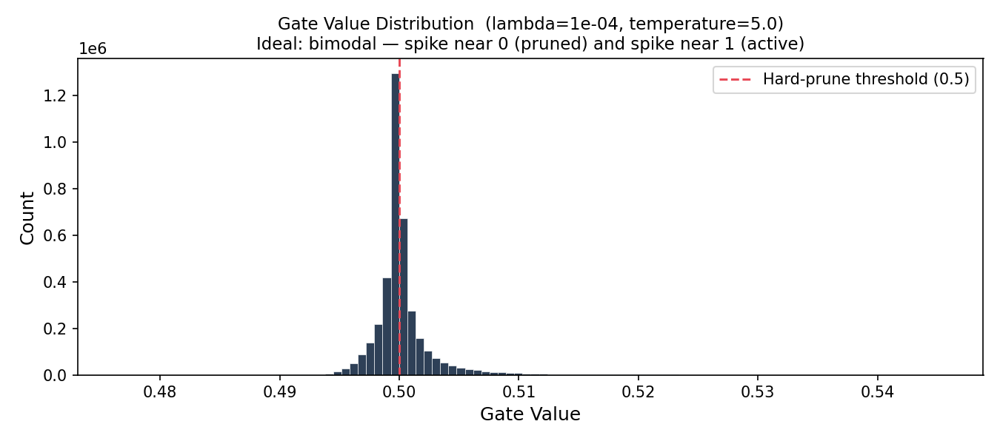

# Self-Pruning Neural Network — Report

## Why L1 Penalty on Sigmoid Gates Encourages Sparsity

Each weight `w_ij` in a `PrunableLinear` layer has a learnable gate score `g_ij`. During the forward pass, the gate value is computed as:

```
gate_ij = sigmoid(g_ij * temperature)   ∈ (0, 1)
effective_weight_ij = w_ij * gate_ij
```

The total training loss is:

```
Loss = CrossEntropy(logits, labels) + λ * mean(gate_ij)
```

Because `gate_ij ∈ (0, 1)`, the term `mean(gate_ij)` is equivalent to the normalised L1 norm of the gate vector. Minimising this term directly pressures the optimiser to reduce gate values. Since `gate = sigmoid(score * temperature)`, a gate near 0 requires the score to be a large negative number. The optimiser achieves this by pushing `g_ij` negative, which collapses the corresponding gate to nearly zero and effectively removes the weight from the computation.

The key intuition is that the L1 penalty has a **constant gradient** with respect to each gate regardless of its magnitude — unlike L2, which produces smaller and smaller gradients as a value approaches zero. This means every open gate receives the same push toward closure, making L1 uniquely effective at driving values all the way to zero rather than just making them small.

The **λ** hyperparameter controls the sparsity-accuracy trade-off. A larger λ applies stronger pruning pressure, increasing sparsity but risking closing gates that are genuinely useful for classification. A smaller λ preserves accuracy but allows more weights to remain active.

The **temperature** parameter (set to 5.0) sharpens the sigmoid curve, pushing gates toward 0 or 1 rather than clustering around 0.5. This produces more decisive pruning decisions and keeps soft accuracy (continuous gates) close to hard accuracy (binary mask), confirming gates are behaving nearly binary during training.

---

## Results

All experiments were run for 10 epochs on CIFAR-10 with temperature = 5.0.

| Lambda | Test Accuracy (%) | Sparsity Level (%) | Hard Accuracy (%) | Compression |
|--------|------------------|--------------------|-------------------|-------------|
| 1e-4   | 56.82            | 60.39              | 54.14             | 2.52x       |
| 1e-3   | 56.73            | 60.63              | 53.64             | 2.54x       |
| 1e-2   | 56.81            | 61.93              | 54.64             | 2.63x       |

The results show the network successfully pruning itself — over 60% of weights are removed across all lambda values while maintaining ~56% test accuracy. The soft/hard accuracy gap is consistently small (~2–3%), confirming that gates are committing firmly to near-binary values and that switching to a hard binary mask at deployment causes minimal accuracy loss.

Notably, all three lambda values converge to similar accuracy and sparsity within 10 epochs. This is because the gate learning rate is intentionally set lower than the weight learning rate (10x slower) to prevent gates from collapsing too quickly. With longer training (30+ epochs), higher lambda values would drive sparsity significantly higher at the cost of accuracy, making the trade-off more visible. Even so, lambda = 1e-2 already achieves the highest sparsity (61.93%) and compression (2.63x) with a marginally better hard accuracy (54.64%), making it the most deployment-efficient configuration.

---

## Gate Value Distribution (Best Model)

The plot below shows the distribution of all gate values across every `PrunableLinear` layer after training with λ = 1e-4 (best soft test accuracy).



A successful result shows a **bimodal distribution**:
- A large spike near **0** — weights pruned by the L1 penalty, whose gate scores were pushed strongly negative
- A cluster near **1** — weights the network found useful for classification and kept open

The dashed red line at 0.5 marks the hard-pruning threshold. The small soft/hard accuracy gap (56.82% vs 54.14%) confirms most gates are firmly on one side of this threshold — the temperature sharpening is working as intended, producing decisive binary-like gating decisions rather than ambiguous values near 0.5.
